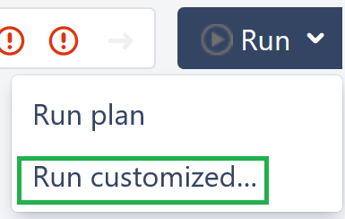
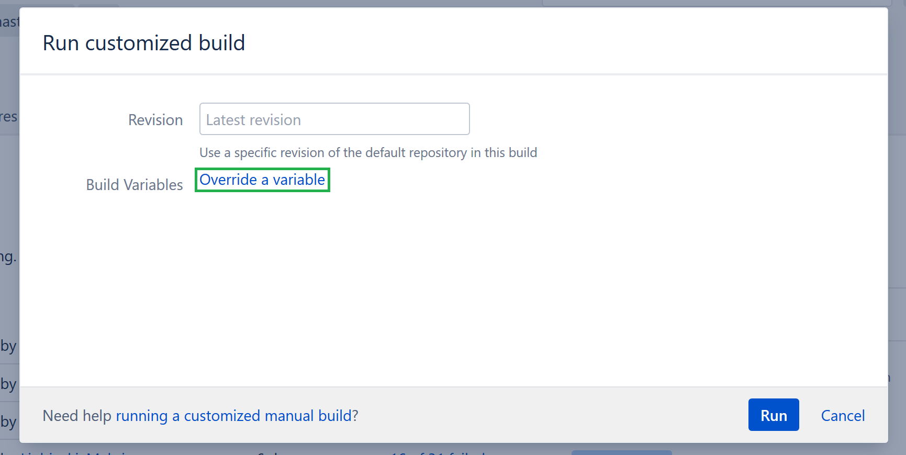
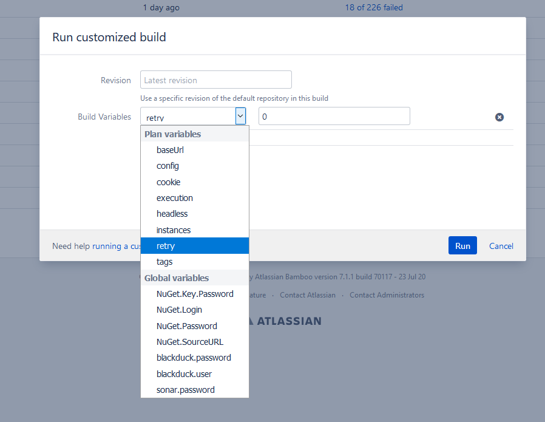
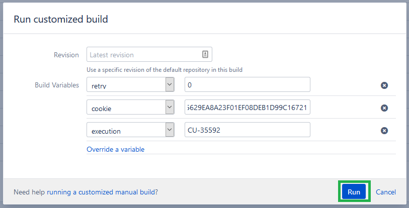

### Gmail Account to be used as Communication Email for all automation users

email: __cch.cheetah.qa@gmail.com__

password: __Epam2020testteam__

### Gmail Account to be used as VL Communication Email for GMAIL API

email: __vitallaw.qa@gmail.com__

password: __qwe123ASD__

### Gmail Account to be used as VLCC Communication Email for GMAIL API

email: __vitallaw1.qa@gmail.com__

password: __qwe123ASD__

### Prerequisites:
 - [Visual Studio Code](https://code.visualstudio.com/) 
 - [Git](https://git-scm.com/downloads) Default installation options should work fine,
 - [NodeJS](https://nodejs.org/) LTS version 8 or above (default options for installation should be fine)
 - [.npmrc file](https://confluence.wolterskluwer.io/display/ARTIFACTORY/Migration+from+NPME+to+JFrog+Artifactory) You might need to click this link one more time after you log into Confluence. You need the TLDR section,steps 1-4 in particular.

For more information on how to get the .npmrc file [click here](https://confluence.wolterskluwer.io/display/ARTIFACTORY/Migration+from+NPME+to+JFrog+Artifactory) You need the TLDR section, steps 1-4 in particular, you don't need steps 5-6. __To log in to jfrog you need to click the SAML SSO button(it looks like cloud with a key in it)__. Once you generate the API key don't forget to click the "save" button at the bottom of the page, before proceeding to use this key.
### Clone cheetah.wke2e repository

```
$> git clone https://bitbucket.wolterskluwer.io/scm/cu/cheetah.wke2e.git
```

First time you will be prompted for credentials, use you WK account credentials, please note that the __username should not include the "@wolterskluwer.com" part__.

And then enter the repo directory:

```
$> cd cheetah.wke2e
```

### How to install:

Run the following commands in the terminal:

```
$> npm install
```
This will install all of the things you need to run tests.
Remember to run `npm install` again each time any of the dependencies in package.json change number.

### Configuring Visual Studio Code

It is highly recommended to use [Visual Studio Code](https://code.visualstudio.com/) to write and edit tests. You will need to install the [Cucumber (Gherkin) Full Support](https://marketplace.visualstudio.com/items?itemName=alexkrechik.cucumberautocomplete) extension for Visual Studio Code.

In order for the autocomplete function for Gherkin to work you will need to edit the setting file.
You need to go to __File(in case you are using MacOS it will be called "Code") -> Preferences -> Settings__. Then you need to click the "Open Settings(JSON)" icon, it will look like a paper sheet with a folded corner. After that you need to replace the setting file content with the following:
```
{
"git.autofetch": true,
"files.autoSave": "onFocusChange",
"cucumberautocomplete.steps": [

"step_definition/*.js"
],

"cucumberautocomplete.syncfeatures": "feature/*feature",

"cucumberautocomplete.strictGherkinCompletion": true,

"cucumberautocomplete.smartSnippets": true,

"editor.quickSuggestions": {

"comments": false,

"strings": true,

"other": true

},
"terminal.integrated.shell.windows": "C:\\WINDOWS\\System32\\cmd.exe",
"diffEditor.ignoreTrimWhitespace": false,
"files.eol": "\r\n"
}
```

### List of product aliases:

+ VL - VitalLaw
+ VLCC - VitalLaw for Corporate Counsel
+ PX - Paychex

### List of environments aliases:

+ VLSTG - https://stg.my.vitallaw.com/
+ VLPROD - https://my.vitallaw.com/
+ VLBLUEPROD - https://alb-prime-b.prod.vitallaw-production.wolterskluwer.cloud/
+ VLDVL - https://dvl.my.vitallaw.com/
+ VLCCSTG - https://stg.corporate.vitallaw.com/
+ VLCCPROD - https://corporate.vitallaw.com/
+ VLCCBLUEPROD - https://alb-prime-b.prod.corporate-vl-prod.wolterskluwer.cloud/
+ VLCCDVL - https://dvl.corporate.vitallaw.com/
+ PXSTG - https://paychex-stg.wolterskluwer.com/
+ PXPROD - https://paychex.wolterskluwer.com/
+ PXBLUEPROD - https://alb-prime-b.prod.paychex-production.wolterskluwer.cloud/
+ PXDVL - https://paychex-dvl.wolterskluwer.com/

# **How to set Environment**
```
set ENV=VLSTG
```
### How to set Headless mode:
```
set HEADLESS=true
```

### How to set specific Url:
```
set BASE_URL=http://localhost
```

### Command to use arguments instead of env variables
```
npm run test -- -- --env "VLPROD" --suite "smoke" --headless "true"

npm run test -- --tags @CU-29699 -- --env "VLSTG" -- --baseUrl "https://alb-30-2-1-cu-40396.stg.vitallaw-development.wolterskluwer.cloud/"
```
Note: make sure to separate those arguments with a "--". 

### Command to run a specific test:
```
npm run test -- --tags "@CU-1234"
```
or set the tag as an environment variable
```
set TAGS=@CU-1234
npm run test
```
to remove the tag from environment variable
```
set TAGS=
```

### Command to run several specific tests:
```
npm run test -- --tags "@CU-1234 or @CU-12345 or @CU-54321"
```
or set the tags as an environment variable
```
set TAGS=@CU-1234 or @CU-12345 or @CU-54321
npm run test
```

### Command to run test on a specific url:
```
npm run test --baseUrl "<urlToRunTestsOn>"
```

### Command to run tests with retries for failed scenarios:
```
npm run test --retry <number of retries>
```

### Command to extract failed and unexecuted tags to the file "tags.txt":
```
npm run extract -- --execution "<jiraTag>"
```

### Command to set all test cases in an execution in "TODO" status:
```
npm run clean-execution -- --execution "<jiraTag>"
```
To rerun specific tests from an execution and update their status, run tests with both "tags" and "execution" arguments. Only tests with specified tags will be set in a TODO status before test run.

Note: make sure to separate the "execution" argument with a "--".
```
npm run test -- --tags "@CU-1234 or @CU-12345 or @CU-54321" -- --execution "CU-12345"
```

### Command to upload test results from report/xray.json to an execution:
```
npm run upload-results -- --execution "<jiraTag>"
```

### Command to update test sets in jira:
```
npm run update -- --testSet "<testSetTag>" --path <pathToFolderWithFeatureFiles>
```

### Command to update cucumber scenarios in jira:
```
npm run update-steps -- --path <pathToFolderWithFeatureFiles>
```

### Command to update Gmail Account token that used as Communication Email for GMAIL API:
```
npm run create-token
```
Note: make sure the credentials of the correct email address are specified in the file ./gmail/quickstart/credentials.json

# **CI**

## **<span style="color:red">Never run "Cheetah Critical Path Fast" and "Cheetah Smoke Fast" CI plans at the same time on prod env!</span>**

## Cheetah ci page

[https://ci.wolterskluwer.io/browse/CHEET](https://ci.wolterskluwer.io/browse/CHEET)

## List of available plans

MVL WDIO:
* https://ci.wolterskluwer.io/browse/CHEET-MI

## How to run plan

1. Go to ci plan for the product\test set you need to run
2. Click "Run" button on the left side of the screen 

## How to run plan with additional parameters

1. Go to ci plan for the product\test set you need to run
2. Click the dropdown icon on the "Run" button on the left side of the screen 

3. Click "Run customized..." button <a href="./assets/run_customized_button_highlighted.png"></a>
4. Click "Override a variable" in the "Run customized build" popup <a href="./assets/run_customized_build_popup_highlighted.png"></a>
5. Change run parameters, in accordance with the instructions for running tests above. Select desired parameter from the "Build Variables" dropdown and specify desired value. Note that all values should be provided without " marks, unlike when running locally. Standart variables to override to run a plan and load results to Jira are: execution, retry, cookie <a href="./assets/run_customized_build_popup_highlighted_variable_field.png"></a>.
6. Click "Run" button <a href="./assets/run_customized_build_popup_highlighted_run_button.png"></a>

## Uploading results to Jira Xray Test Execution

1. Open finished ci plan run
2. Open "Artifacts" tab
3. Click "Xray report" link
4. Choose "Save File" option in popup if prompted
5. Open Jira Xray Test Execution
6. Click "More" dropdown
7. Click "Import Exeсution Results"
8. Select the file you downloaded in steps 3-4
9. Click "Import" button

## Uploading results during execution

1. Follow instructions from the [How to run plan with additional parameters] section up-to the 5th step
2. Select the `execution` variable from the "Build Variables" and set its value to your test execution tag (ex. `CU-12345`).

## Cleanup test statuses in Jira before execution
To do so you need to change `"clean"` variable in ci plan to `"true"`
